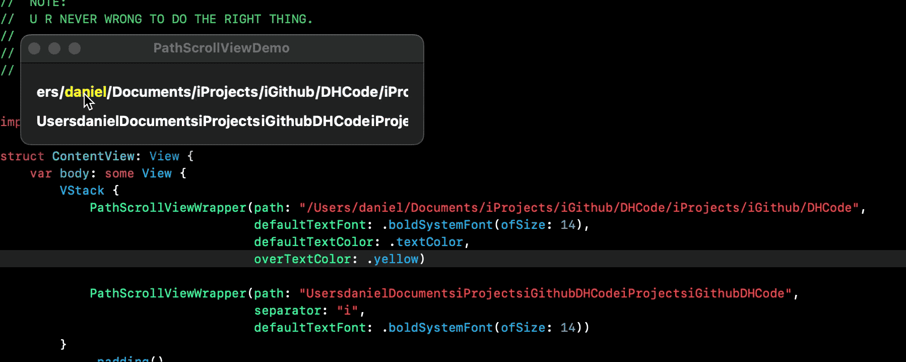

# PathScrollView
macOS SwiftUI path scroll view

### Usage
```swift

PathScrollViewWrapper(path: "/Users/daniel/Documents")

// separator by "/"
PathScrollViewWrapper(path: "/Users/daniel/Documents/iProjects/iGithub/DHCode/iProjects/iGithub/DHCode",
                                  defaultTextFont: .boldSystemFont(ofSize: 14),
                                  defaultTextColor: .textColor,
                                  overTextColor: .yellow)

// separator by "i"
PathScrollViewWrapper(path: "UsersdanielDocumentsiProjectsiGithubDHCodeiProjectsiGithubDHCode",
                                  separator: "i",
                                  defaultTextFont: .boldSystemFont(ofSize: 14))
```

